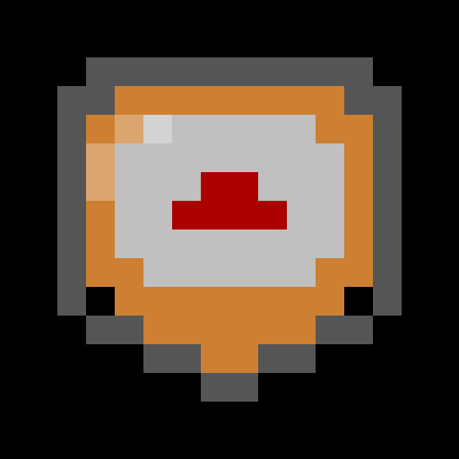

# BITBRAWLER - 8-Bit Arena

<p align="center">
  
</p>

<p align="center">
  
  
  
  
  
  
  
</p>

Bitbrawler is a **retro 8-bit arena experience** where players create a pixel fighter, battle in the arena, and climb the Hall of Fame. Built with React, TypeScript, and Supabase. The entire development process is **autonomous** using OpenCode agents.

---

## 🚀 Quick Start

### For Players
- Visit **[bitbrawler.vercel.app](https://bitbrawler.vercel.app)** to play live
- Create a character and start fighting!

### For Developers
See [CONTRIBUTING.md](CONTRIBUTING.md) for setup, development guidelines, and how to contribute.

### For AI/OpenCode Agents
See [AGENTS.md](AGENTS.md) for autonomous agent workflows and responsibilities.

---

## Table of Contents

- [Features](#features)
- [Quick Links](#quick-links)
- [Tech Stack](#tech-stack)
- [Getting Started](#getting-started)
- [Scripts](#scripts)
- [Project Structure](#project-structure)
- [CI/CD & Workflows](#cicd--workflows)
- [Autonomous Development](#autonomous-development)
- [License](#license)

---

## Features

- **8-bit UI** with SVG pixel rendering
- **Character creation** with RPG stats (STR, VIT, DEX, LUK, INT, FOC)
- **Arena fights** with XP gain, level ups, and enhanced combat (crit + magic + focus)
- **PvE Monster Battles** — fight 3 8-bit monsters (Goblin/Ogre/Wraith) with separate energy pool (5 fights/day)
- **Strict same-level matchmaking** with power balancing, daily opponent rotation, and animated opponent scan
- **Daily lootbox + inventory** — 33 items across 3 slots (weapon/armor/accessory), 5 rarities (common→legendary), stat bonuses including HP
- **Equipment loadouts** — manual equip/unequip with 6 weapon elements (fire/water/wind/earth/light/dark), affinity system (+15% damage vs bot archetypes)
- **6 bot archetypes** (bruiser/tank/rogue/mage/lucky/zen) with elemental weakness mapping
- **Equipment Forge** — salvage unwanted items for essence, fuse 3 same-rarity items for a higher tier, spend essence to upgrade stats up to +5
- **Bot engine** — population management with organic activity pacing, depleted-bot skipping, and protection rebalance
- **Global daily reset** — scripted resets at midnight (Paris) for fights and opponent tracking
- **Hall of Fame** rankings with real-time updates
- **PWA** install experience (works offline)
- **Autonomous CI/CD** with agent-driven development

## Quick Links

| Document | Purpose |
|----------|---------|
| [ARCHITECTURE.md](ARCHITECTURE.md) | Technical design, database schema, system overview |
| [WORKFLOWS.md](WORKFLOWS.md) | CI/CD pipelines, GitHub Actions, deployment flow |
| [CONTRIBUTING.md](CONTRIBUTING.md) | Development setup, coding conventions, PR process |
| [AGENTS.md](AGENTS.md) | OpenCode agent workflows, responsibilities, automation |
| [TESTING.md](TESTING.md) | Testing guidelines, test structure, writing tests |

---

## Tech Stack

| Layer          | Technology                                      |
| -------------- | ----------------------------------------------- |
| Frontend       | React 18 + TypeScript + Vite                    |
| Backend / Auth | Supabase (PostgreSQL, real-time, auth)          |
| Testing        | Vitest + React Testing Library + jsdom — **764 tests, 70 files**          |
| Styling        | Sass (SCSS)                                     |
| Fonts          | Press Start 2P (via Fontsource)                 |
| Scripting      | tsx (TypeScript executor)                       |
| CI/CD          | GitHub Actions + OpenCode + Vercel              |
| E2E Testing    | Playwright                                      |

---

## Getting Started

### 1. Clone the repo
```bash
git clone https://github.com/stxtxm/bitbrawler.git
cd bitbrawler
```

### 2. Install dependencies
```bash
npm install
```

### 3. Configure environment variables
```bash
cp .env.example .env
# Fill in your Supabase URL and anon key
```

### 4. Run locally
```bash
npm run dev
```

The app will be available at `http://localhost:5173`

**See [CONTRIBUTING.md](CONTRIBUTING.md) for full setup instructions.**

---

## Scripts

```bash
# Development
npm run dev                        # Start Vite dev server (localhost:5173)
npm run preview                    # Preview production build

# Testing & Quality
npm test                           # Run test suite (Vitest — 469+ tests, 55 files)
npm run lint                       # ESLint check
npm run build                      # TypeScript check + Vite production build

# Game Systems (for testing)
npm run bots:run                   # Run bot simulation engine once
npm run daily-reset:run            # Run daily reset script once

# Analytics
npx tsx scripts/analyze-qa-stats.ts  # Analyze QA stats (HP growth, loot rarity, trends)
```

See [WORKFLOWS.md](WORKFLOWS.md) for how these scripts are used in CI/CD.

---

## Project Structure

```
bitbrawler/
├── .github/workflows/              # GitHub Actions CI/CD pipelines
│   ├── ci.yml                      # Lint, type check, test, build
│   ├── opencode.yml                # OpenCode agent implementation workflow
│   ├── reviewer.yml                # Auto code review + merge
│   ├── tech-lead.yml               # Daily analysis + issue creation
│   ├── qa-tester.yml               # Playwright E2E tests (live site)
│   ├── bot-activity.yml            # Scheduled bot engine runs
│   └── daily-reset.yml             # Scheduled global daily reset
│
├── .opencode/agents/               # OpenCode agent definitions
│   ├── dev-agent.md                # Autonomous developer
│   ├── reviewer.md                 # Autonomous code reviewer
│   ├── tech-lead.md                # Autonomous tech lead
│   └── qa-tester.md                # Autonomous QA tester
│
├── docs/                           # Documentation
│   ├── ARCHITECTURE.md             # Technical design & system overview
│   ├── WORKFLOWS.md                # CI/CD & automation flows
│   ├── CONTRIBUTING.md             # Developer guidelines
│   ├── AGENTS.md                   # Autonomous agent documentation
│   └── TESTING.md                  # Testing guidelines
│
├── public/                         # Static assets
│   ├── sw.js                       # Service worker (PWA)
│   ├── icon.svg                    # App icon
│   └── icon-*.png                  # PWA manifest icons
│
├── scripts/                        # Automation scripts
│   ├── bot-engine.ts               # Bot simulation engine
│   ├── daily-reset-engine.ts       # Global daily reset logic
│   ├── analyze-qa-stats.ts         # QA stats analysis
│   └── supabaseAdmin.ts            # Supabase admin utilities
│
├── qa/                             # QA & E2E testing
│   ├── qa-bot.mjs                  # Playwright E2E tests
│   ├── qa-bot.config.js            # QA configuration
│   ├── stats.json                  # Fight stats (auto-generated)
│   └── analysis-latest.json        # Analyzed stats report (auto-generated)
│
├── supabase/                        # Database migrations
│   └── migrations/                  # SQL migration files
│
├── src/
│   ├── components/                 # UI building blocks
│   │   ├── AffinityBadge.tsx        # Weapon element badge
│   │   ├── CombatView.tsx           # Fight overlay (intro/VS/combat/result)
│   │   ├── ConnectionModal.tsx      # DB connection gate modal
│   │   ├── GameLogo.tsx             # 8-bit SVG logo
│   │   ├── LevelUpOverlay.tsx       # Stat allocation on level-up
│   │   ├── LoadingScreen.tsx        # Loading spinner
│   │   ├── PixelCharacter.tsx       # Seed-based character SVG
│   │   ├── PixelIcon.tsx            # Generic 8×8 pixel icon
│   │   ├── PixelItemIcon.tsx        # Item sprite SVG
│   │   ├── PixelMonster.tsx         # Monster 16×16 SVG
│   │   ├── StatusScreen.tsx         # Status display component
│   │   ├── StreakIndicator.tsx      # Lootbox streak progress
│   │   └── ErrorBoundary.tsx        # React error boundary
│   │
│   ├── config/                     # Game configuration
│   │   ├── gameRules.ts            # Game constants & balance values
│   │   ├── combatBalance.ts        # Combat formulas & scaling
│   │   └── supabase.ts             # Supabase client initialization
│   │
│   ├── context/                    # React context (game state, persistence)
│   │
│   ├── data/                       # Static data
│   │   ├── itemAssets.ts           # Item definitions, stats, rarities
│   │   └── updateNotes.ts          # Version history, patch notes
│   │
│   ├── pages/                      # Route pages
│   │   ├── Arena.tsx
│   │   ├── CharacterCreation.tsx
│   │   ├── HomePage.tsx
│   │   ├── Login.tsx
│   │   ├── Rankings.tsx
│   │   └── NotFound.tsx
│   │
│   ├── styles/                     # Global Sass styles
│   │   └── ...scss files
│   │
│   ├── test/                       # Vitest test suite (469+ tests, 55 files)
│   │   └── ...test files
│   │
│   ├── types/                      # TypeScript type definitions
│   │   ├── Character.ts
│   │   ├── Item.ts
│   │   └── ...
│   │
│   └── utils/                      # Game logic utilities
│       ├── botBehaviorUtils.ts     # Bot logic
│       ├── combatUtils.ts          # Fight calculations
│       ├── characterUtils.ts       # Character operations
│       ├── matchmakingUtils.ts     # Opponent selection
│       ├── lootboxUtils.ts         # Loot rarity & distribution
│       ├── xpUtils.ts              # XP & leveling
│       └── ...
│
├── .env.example                    # Environment template
├── package.json                    # Dependencies & scripts
├── tsconfig.json                   # TypeScript configuration
├── vite.config.ts                  # Vite build configuration
└── README.md                       # This file
```

See [ARCHITECTURE.md](ARCHITECTURE.md) for detailed database schema and system design.

---

## CI/CD & Workflows

Bitbrawler uses **automated GitHub Actions workflows** for continuous integration and deployment:

| Workflow | Trigger | Purpose |
|----------|---------|---------|
| **CI** | PR opened/updated | Lint, type check, test, build |
| **OpenCode** | Issue with `/oc` | Autonomous agent implementation |
| **Reviewer** | PR created | Auto code review + merge if approved |
| **Tech Lead** | Daily @ 21h (Paris) | Analyze QA stats, create strategic issues |
| **QA Tester** | Manual / scheduled | Run E2E tests on live site, collect stats |
| **Bot Activity** | Manual / scheduled | Run bot simulation engine |
| **Daily Reset** | Daily @ 00h (Paris) | Reset characters, fights, opponent tracking |

**See [WORKFLOWS.md](WORKFLOWS.md) for detailed workflow documentation.**

---

## Autonomous Development

Bitbrawler uses [**OpenCode**](https://opencode.ai) agents for **autonomous development**:

| Agent | Role | Trigger |
|-------|------|---------|
| **dev-agent** | Implements features from issues | `/oc` in issue body |
| **reviewer** | Reviews PRs, approves & merges | Automatic on PR |
| **tech-lead** | Daily analysis, creates strategic issues | Scheduled @ 21h |
| **qa-tester** | E2E tests on live site | Scheduled |

### How it works

1. **Create an issue** with `/oc` in the description
2. **dev-agent** implements the feature automatically
3. **CI checks** run (lint, test, build)
4. **reviewer** reviews the code
5. **If approved** → automatic squash merge ✅
6. **If issues** → feedback on PR ❌

**See [AGENTS.md](AGENTS.md) for detailed agent documentation.**

---

## License

This project is licensed under the MIT License. See the [LICENSE](LICENSE) file for details.

---

## Need Help?

- **Setup Issues?** → See [CONTRIBUTING.md](CONTRIBUTING.md)
- **Want to contribute?** → Read [CONTRIBUTING.md](CONTRIBUTING.md)
- **Understanding workflows?** → Check [WORKFLOWS.md](WORKFLOWS.md)
- **How agents work?** → Read [AGENTS.md](AGENTS.md)
- **Testing guidelines?** → See [TESTING.md](TESTING.md)
- **Architecture questions?** → Check [ARCHITECTURE.md](ARCHITECTURE.md)
